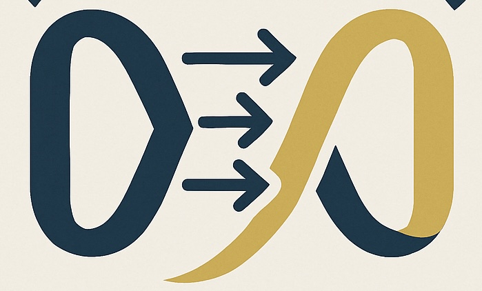

<p align="center">
    
</p>

# arc_vec

[![Crates.io][crates-badge]][crates-url]
[![MIT licensed][mit-badge]][mit-url]
[![Rust_Documentation][rust-doc-badge]][doc-url]


[crates-badge]: https://img.shields.io/crates/v/arc_vec.svg
[crates-url]: https://crates.io/crates/arc_vec
[mit-badge]: https://img.shields.io/badge/license-MIT-blue.svg
[mit-url]: https://github.com/tokio-rs/tokio/blob/master/LICENSE
[rust-doc-badge]: https://img.shields.io/badge/rust-documentation-blue
[doc-url]: https://docs.rs/arc_vec/latest/arc_vec/

- Arc Vector
  - Experimental work to run vectors in parallel


```rust
// Consider Arc<[T]> over Vec <T>
// Arc<[T]>
use arc_vec::alloc::arc_vec::ArcVec;
let my_num_arcvec_init: ArcVec<i32> = ArcVec::new();

```

# dependencies

```toml
[dependencies]
arc_vec = "0"

```

# example

- `arcnew`

```rust
use arc_vec::alloc::arc_vec::ArcVec;

fn main() {
    let my_arc_vec = ArcVec::new();
    my_arc_vec.push(10);
    println!("arc_vec int push : {}", my_arc_vec);
}
```

- macro

```rust
use arc_vec::arc_vec;

fn main() {
    let arc_test = arc_vec!(2);
    println!("arc_vec : {}", arc_test);
}
```

# Todo

- [ ] sort, reverse
- [ ] append string
- [ ] benches
  - [ ] arcvec vs Vec::new

## License

This project is licensed under the [MIT license].

[MIT license]: https://github.com/YoungHaKim7/arc_vec/blob/main/LICENSE

### Contribution

Unless you explicitly state otherwise, any contribution intentionally submitted
for inclusion in ArcVec by you, shall be licensed as MIT, without any additional
terms or conditions.
