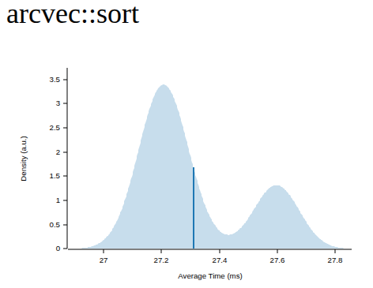

<p align="center">
    
</p>

# arc_vec

[![Crates.io][crates-badge]][crates-url]
[![MIT licensed][mit-badge]][mit-url]
[![Rust_Documentation][rust-doc-badge]][doc-url]


[crates-badge]: https://img.shields.io/crates/v/arc_vec.svg
[crates-url]: https://crates.io/crates/arc_vec
[mit-badge]: https://img.shields.io/badge/license-MIT-blue.svg
[mit-url]: https://github.com/tokio-rs/tokio/blob/master/LICENSE
[rust-doc-badge]: https://img.shields.io/badge/rust-documentation-blue
[doc-url]: https://docs.rs/arc_vec/latest/arc_vec/

- Arc Vector
  - Experimental work to run vectors in parallel


```rust
// Consider Arc<[T]> over Vec <T>
// Arc<[T]>
use arc_vec::alloc::arc_vec::ArcVec;
let my_num_arcvec_init: ArcVec<i32> = ArcVec::new();

```

# dependencies

```toml
[dependencies]
arc_vec = "0"

```

# example

- `arcnew`

```rust
use arc_vec::alloc::arc_vec::ArcVec;

fn main() {
    let my_arc_vec = ArcVec::new();
    my_arc_vec.push(10);
    println!("arc_vec int push : {}", my_arc_vec);
}
```

- macro

```rust
use arc_vec::arc_vec;

fn main() {
    let arc_test = arc_vec!(2);
    println!("arc_vec : {}", arc_test);
}
```

# 성능 평가 benches
- [criterion.rs](https://github.com/bheisler/criterion.rs) - Statistics-driven benchmarking library for Rust 

# `cargo bench`

|rayon<br>parallel_sort()|vs|basic sort()|
|-|-|-|
||vs||
|-|Estimate|-|
|1.9257 µs|Slope|514.64 ns|
|	0.9852021|R²|0.9618972|
|1.9312 µs|Mean|515.52 ns|
|34.526 ns|Std. Dev.|8.3499 ns|
|1.9253 µs|Median|515.92 ns|
|16.439 ns|MAD|3.3948 ns|

- Understanding this report:
  - The plot on the left displays the average time per iteration for this benchmark. The shaded region shows the estimated probability of an iteration taking a certain amount of time, while the line shows the mean. Click on the plot for a larger view showing the outliers.

  - The plot on the right shows the linear regression calculated from the measurements. Each point represents a sample, though here it shows the total time for the sample rather than time per iteration. The line is the line of best fit for these measurements.

- See the [documentation](https://bheisler.github.io/criterion.rs/book/user_guide/command_line_output.html#additional-statistics) for more details on the additional statistics.

### rayon_parallel_sort 


### basic sort


- example

```bash
$ cargo r --example sort_comparison

Array size: 1_000_000
Standard sort took: 511.425875ms
Parallel sort took: 2.315417ms

```

# Todo

- [x] sort fn
- [ ] reverse fn
- [ ] append string
- [ ] benches
  - [ ] ArcVec VS Vec::new
  - [x] Parallel sort VS Basic Sort
- [ ] Docs
  - [ ] lib.rs_rayon내용추가
  - [ ] concurrency VS parallelism 차이점

## License

This project is licensed under the [MIT license].

[MIT license]: https://github.com/YoungHaKim7/arc_vec/blob/main/LICENSE

### Contribution

Unless you explicitly state otherwise, any contribution intentionally submitted
for inclusion in ArcVec by you, shall be licensed as MIT, without any additional
terms or conditions.
